# All About This Project

> **In one sentence:** This project builds a friendly website that turns Zoho Desk API blueprints into searchable documentation — automatically — using an open-source library called **Fumadocs**, with hand-written guide pages shown first.

---

## Why this project exists

Software products talk to Zoho Desk through **APIs** (application programming interfaces). Think of an API as a menu of allowed requests: “create a ticket,” “get an account,” “list articles,” and so on.

Those menus are written down in a technical format called **OpenAPI Specification (OAS)** — structured recipe files that describe every request in precise detail.

**The problem:** Recipe files are great for machines, but hard for people to read.

**The solution:** This project:

1. Reads **portable OAS blueprints** from the `oas/` folder
2. Uses **Fumadocs** to generate the API reference automatically
3. Also shows **static (hand-written) guide pages** at the start of the documentation — getting started, OAuth, API credits, and similar — so newcomers land on helpful context before diving into hundreds of API operations

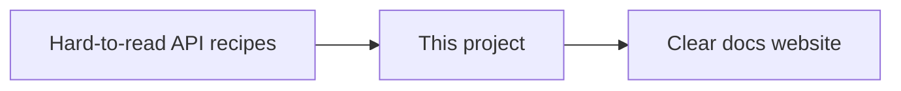

| Before | After |
| --- | --- |
| Hundreds of technical JSON files | A browsable documentation site |
| Developers dig through specs by hand | Search, navigation, and readable pages |
| Docs drift when APIs change | Docs regenerate from the latest blueprints |
| No onboarding story | Static intro guides appear first in the sidebar |

---

## Two kinds of documentation content

Fumadocs powers the site. Content comes from **two sources**:

| Source | What it is | Where it lives | How it appears |
| --- | --- | --- | --- |
| **Static pages** | Hand-written guides (intro, auth, credits, SDKs, …) | Authored under `content/docs/` | Listed **first** in the docs navigation |
| **Generated API docs** | One page per API operation | Built by Fumadocs from each file in `oas/` | Appear **after** the guides (auto-discovered) |

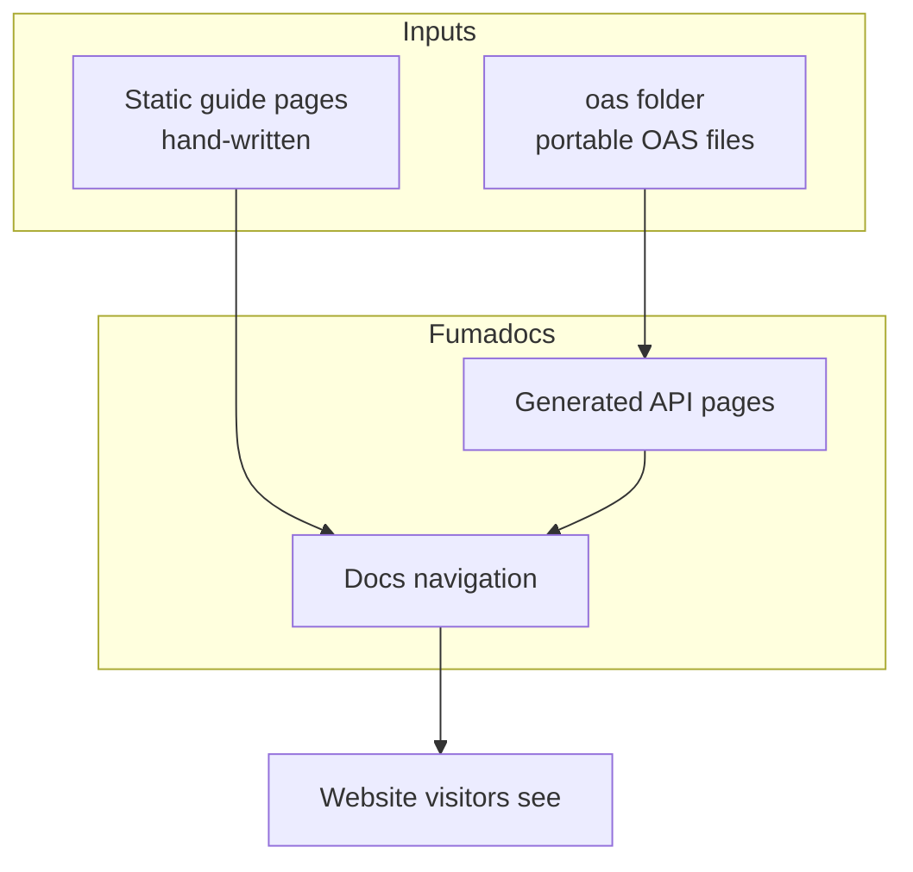

The root navigation order is controlled so guides come first, then all generated API sections:

1. Home / index  
2. Getting Started  
3. OpenAPI Specification overview  
4. API Credits  
5. Authentication (OAuth)  
6. Webhooks, Help Center, Java SDK, …  
7. Then every generated API module (accounts, tickets, and so on)

> **For the curious:** That order is defined in `content/docs/meta.json`. The `"..."` entry tells Fumadocs to append all other generated folders after the listed static sections.

---

## The big picture: from blueprint to website

Here is the journey from “API blueprint” to “page a visitor can read”:

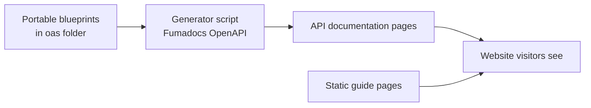

In plain English:

1. **Portable blueprints** in `oas/` describe Zoho Desk APIs in a self-contained format Fumadocs can read.
2. A **generator** (powered by Fumadocs) turns those blueprints into API documentation pages.
3. **Static guide pages** sit at the front of the docs as the first chapters people should read.
4. The **website** (Next.js + Fumadocs) serves both guides and the API reference.
5. Visitors open the site, search, and read — without touching the raw blueprint files.

> **For the curious:** Blueprints live in `oas/`. The generator is `scripts/generate-docs.mjs`. Pages land in `content/docs/`. The site is hosted on Zoho Catalyst.

---

## What visitors see on the site

The site is branded **Zoho Desk API Documentation**. Opening the home page takes you straight into the docs.

| Kind | What it is | Who writes it |
| --- | --- | --- |
| **Static guides (initial pages)** | Getting started, OAuth login, API credits, webhooks, Help Center, Java SDK, and more | People, by hand |
| **API reference** | One page per API action (get account, create ticket, …) | Generated automatically from `oas/` via Fumadocs |

Rough scale of the current content:

| Item | About how many |
| --- | --- |
| Active portable OAS files in `oas/` | **~150+** |
| Auto-generated API pages | **~700+** |
| Hand-written / static guide pages | **~30** |
| Total documentation pages | **~730+** |

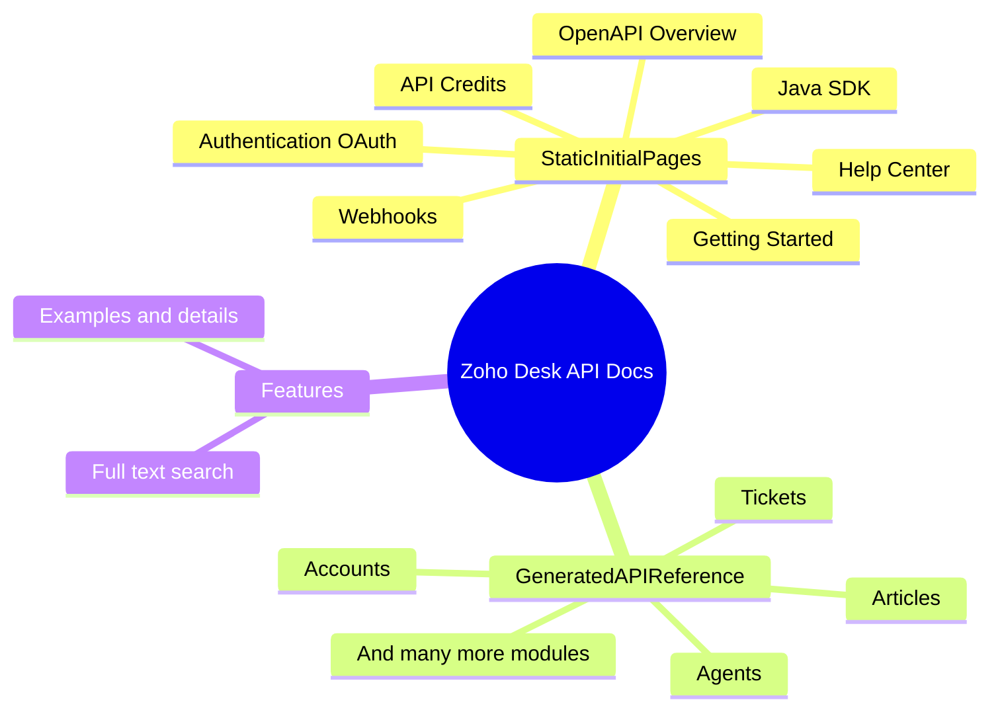

Visitors can also **search** across all pages from the documentation UI.

---

## How automatic generation works

A helpful analogy:

| Everyday idea | In this project |
| --- | --- |
| Recipe book | Portable OAS files in `oas/` |
| Kitchen | Fumadocs OpenAPI generator |
| Plated dishes | Generated documentation pages (MDX) |
| Front-of-house menu | Static guide pages shown first |
| Dining room | The website that shows both — and still checks the recipes for live API details |

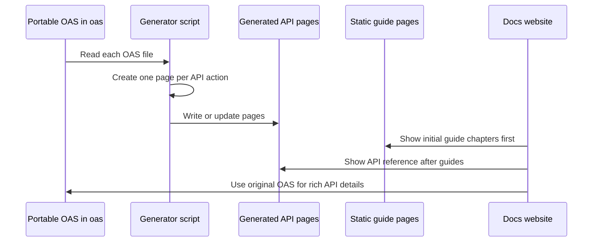

### What the generator does (kept light)

- Scans every blueprint in `oas/`
- Creates **one documentation page per API operation** (for example: “Get Account”)
- Groups pages into folders by topic/tag (for example: accounts, tickets)
- **Protects static guide folders** so they are not overwritten
- Skips work when a blueprint has not changed (faster rebuilds)
- Cleans up leftover pages if a blueprint was removed

Generation runs when someone starts local development or builds the site for publishing — so the API reference stays aligned with the blueprints.

> **Important:** Auto-generated API pages should not be edited by hand. To change the API reference, update the OAS file in `oas/`, then regenerate. To change the intro experience, edit the static guide pages.

---

## Upstream product layout: why `resources/` exists

In the **main Zoho Desk product**, OAS files are **not** stored as one flat, self-contained folder. They follow a split architecture:

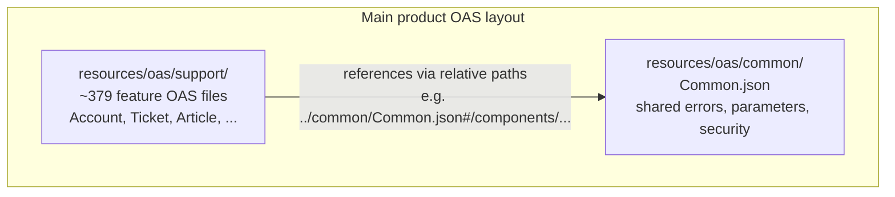

| Location | Role |
| --- | --- |
| `resources/oas/support/` | One OAS file per product feature / module (Account, Ticket, SLA, Workflow, …) |
| `resources/oas/common/Common.json` | Shared building blocks — common error responses, shared parameters (such as org id), and similar definitions |

A support file does **not** copy those shared pieces. It **points** to them with references (called `$ref` in OpenAPI), for example:

- `../common/Common.json#/components/responses/invalidDataErrorResponse`
- `../common/Common.json#/components/parameters/orgId`

That is efficient for the product team: fix a shared error once in `Common.json`, and every feature that references it stays consistent.

### Why Fumadocs needs a different shape

Fumadocs (and many OpenAPI tools) work best with **portable** specs: each feature file should be usable on its own, with shared pieces already **merged in** (or rewritten so references stay inside that one file / local folder).

So the product’s split layout (`support/` + `common/`) must be converted into **portable OAS files** before this docs site can use them. In this repository, those portable files live in `oas/` — that is what Fumadocs actually reads.

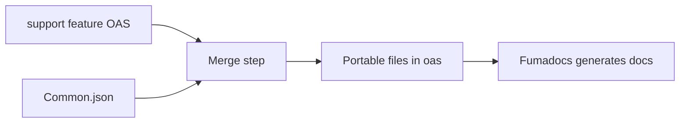

| Folder | Audience | Shape |
| --- | --- | --- |
| `resources/oas/` | Main product / source archive | Split: feature files + shared `Common.json` |
| `oas/` | This Fumadocs docs site | Portable / flattened files ready for generation |

---

## How portable OAS is produced (the Java merge tool)

In the main product, a Java utility named **`MergeAndGenerateDocs`** converts the split layout into portable specs. Below is what that code does, step by step, in plain language.

### Goal

Take every file in `support/`, combine it with shared definitions from `common/Common.json`, and write out **self-contained merged JSON files** plus a small **master index** the docs UI can use for navigation/search.

### Inputs and outputs

| Item | Path (in the Java tool) | Meaning |
| --- | --- | --- |
| Shared definitions | `src/main/resources/oas/common/Common.json` | Common errors, parameters, security schemes |
| Feature specs | `src/main/resources/oas/support/*.json` | One file per feature |
| Merged outputs | `target/dist/<Feature>-merged.json` | Portable OAS per feature |
| Master index | `target/dist/feature-api.json` | List of features, URLs to merged files, and API name summaries |

Default API server URL used when a feature file has none: `https://desk.zoho.com`.

### Step-by-step flow

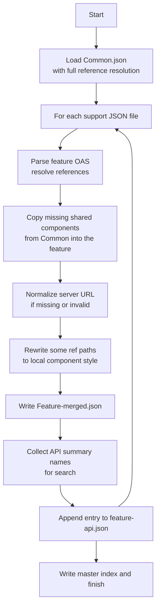

#### 1. Prepare the output folder

Creates `target/dist/` so merged files and the master index have a place to land.

#### 2. Load `Common.json` first

Uses the official OpenAPI parser (`OpenAPIV3Parser`) with:

- **resolve** turned on — follow `$ref` links  
- **resolveFully** turned on — expand nested references as far as possible  

If `Common.json` cannot be loaded, the tool stops. Everything else depends on those shared components.

#### 3. Walk every support feature file

For each `*.json` in the support folder (for example `Account.json` → feature name `Account`):

1. **Parse** that feature file the same way (resolve references).
2. Ensure it has a **components** section (create an empty one if missing).
3. **Merge components** from Common into the feature (see below).
4. **Normalize servers** — if there is no server URL (or it is empty / too short), set the default Desk URL.
5. Convert the merged OpenAPI object back to pretty JSON.
6. **Fix a class of `$ref` paths** so they point at local components (`#/components/...`) instead of an absolute-looking `/components...` form left behind after resolution.
7. Write `target/dist/Account-merged.json` (and similarly for every other feature).

If a feature file fails to parse, it is **skipped** with a warning; other features continue.

#### 4. Merge components (the heart of “portable”)

Shared pieces are copied **into** the feature file’s own components, but only when the feature does not already define the same name (`putIfAbsent` — feature-local wins if both exist).

Merged categories:

- **Schemas** — shared data shapes  
- **Responses** — shared error / success response definitions  
- **Parameters** — shared query/header/path parameters  
- **Security schemes** — how auth is described  

After this step, the feature file no longer needs to reach into `../common/Common.json` for those shared items — they live inside the merged document.

#### 5. Build API summaries for search

For every path and HTTP method (GET, POST, PUT, DELETE, PATCH), the tool records a short human label:

- Prefer the operation’s **summary** text  
- If summary is missing, fall back to the **path** string  
- Escape quotes/newlines so the master JSON stays valid  

#### 6. Append one entry to the master index

Each feature becomes an object roughly like:

- **name** — feature name (e.g. `Account`)  
- **url** — where the UI can load the merged file (e.g. `/specs/Account-merged.json`)  
- **apis** — list of summary strings for search / browsing  

#### 7. Write `feature-api.json`

After all features are processed, the tool saves the master list:

```text
{
  "features": [
    { "name": "...", "url": "/specs/...-merged.json", "apis": ["...", "..."] },
    ...
  ]
}
```

That file is what a servlet / docs UI can serve as the catalog of available specs.

### Why this matters for *this* Fumadocs project

| Stage | Where | Purpose |
| --- | --- | --- |
| Product source of truth | `resources/oas/support` + `resources/oas/common` | Maintain APIs with shared errors in one place |
| Merge / flatten | Java `MergeAndGenerateDocs` (in the main product) | Produce portable, self-contained OAS |
| Docs input | `oas/` in this repo | Fumadocs reads these portable files |
| Static intro | Hand-written pages under `content/docs/` | First chapters in the published documentation |
| Docs output | Generated MDX + Fumadocs UI | Human-readable API documentation website |

> In short: **product OAS is split for maintainability; merged OAS is portable for tooling; Fumadocs documents the portable files; static pages greet the reader first.**

### Three touch-ups applied while a spec is loaded

The blueprints are written for Java tooling, and three details in them do not survive a trip through a
web browser. `lib/openapi.ts` repairs each spec in memory as it is read, so the files on disk stay
exactly as the product's merge tool produced them:

| Touch-up | What it fixes | Why it is needed |
| --- | --- | --- |
| Shared definitions are inlined | `$ref`s such as `./Common.json#/components/parameters/orgId` become in-document references | Almost every file in `oas/` still points at `Common.json`, and a spec read as data has no folder to resolve neighbours against |
| A base URL is filled in | Adds `https://desk.zoho.com` when a spec declares no absolute server | Without it the request samples are built against a placeholder host on the server and the real host in the browser, and the page reports a mismatch |
| Regex patterns are translated | Rewrites Java-only syntax such as `\P{InBasicLatin}` or `\,` into the JavaScript equivalent, dropping the handful that have none | The browser compiles every pattern it renders, and a single unusable one takes the whole page down |

---

## Map of the project folder

Think of the repository as a house. Each room has a job:

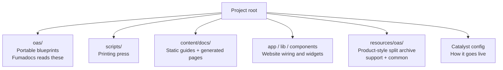

| Folder or file | In plain English |
| --- | --- |
| `oas/` | **What Fumadocs reads** — portable API blueprints used to generate the API reference |
| `content/docs/` | Documentation pages: **static initial guides** + **generated** API pages |
| `scripts/` | The **printing press** that turns `oas/` blueprints into generated pages |
| `app/`, `lib/`, `components/` | Website structure, shared settings, and special widgets (for example credit calculators) |
| `public/` | Images and other static assets used in guides |
| `resources/oas/support/` | Product-style feature OAS files (source archive layout) |
| `resources/oas/common/Common.json` | Shared errors / parameters those support files reference |
| `catalyst.json`, `app-config.json`, `.catalystrc` | Settings for deploying on Zoho Catalyst |
| `package.json` | Project “instruction sheet”: dependencies and commands |
| `README.md` | Short developer-oriented quick start |
| `.nvmrc` | Pins Node.js **20** for this project |

---

## Tools used (the kitchen appliances)

This project is built on well-known open-source pieces. The star of the show for documentation is **Fumadocs**.

```mermaid
flowchart TB
  visitor[Visitor]
  nextjs[Next.js - website engine]
  fumadocs[Fumadocs - docs framework]
  openapi[fumadocs-openapi - blueprint to pages]
  style[Tailwind CSS - look and feel]
  host[Zoho Catalyst AppSail - hosting]

  visitor --> nextjs
  nextjs --> fumadocs
  fumadocs --> openapi
  fumadocs --> style
  nextjs --> host
```

| Tool | Role in plain English |
| --- | --- |
| **Fumadocs** | Open-source library that powers the documentation experience (layout, MDX, search, OpenAPI integration) |
| **fumadocs-openapi** | The part of Fumadocs that turns portable OpenAPI blueprints in `oas/` into API pages |
| **Next.js** | The website engine that runs and serves the docs |
| **React** | The UI building blocks the website is written with |
| **Tailwind CSS** | Styling that keeps the site consistent and readable |
| **Zoho Catalyst AppSail** | Where the finished site runs in Zoho’s cloud (Node 20) |
| **Swagger / OpenAPI Java parser** (main product) | Used by `MergeAndGenerateDocs` to resolve and merge `Common.json` into each support file |

---

## How the site goes live

Publishing is a short pipeline: install ingredients → print pages from blueprints → build the website → serve it.

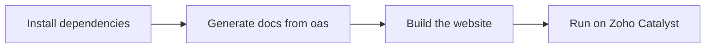

What that means for non-engineers:

1. The hosting platform installs what the project needs.
2. The generator rebuilds API documentation pages from the latest portable blueprints in `oas/`.
3. Static guide pages are included as authored.
4. The website is compiled into a production-ready form.
5. Catalyst runs the site so people can open it in a browser.

> Generated documentation pages are **rebuilt during deploy** rather than treated as frozen copies that must be uploaded by hand. That keeps the published API reference in sync with the blueprints.

The Catalyst project for this work is named **APIDocUsingFumaDoc**.

---

## Who does what

| Role | Responsibility |
| --- | --- |
| **API / product owners** | Keep product OAS accurate in the split `support/` + `common/` layout |
| **Merge / platform tooling** | Produce portable OAS (for example via `MergeAndGenerateDocs`) that can feed this docs site |
| **Documentation authors** | Write and maintain the **static initial guides** under `content/docs/` |
| **This project (automation)** | Reads `oas/`, regenerates the API reference with Fumadocs, and publishes the website |
| **Developers / partners** | Read the published site to integrate with Zoho Desk APIs |

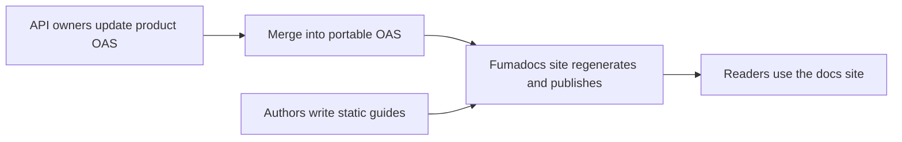

---

## Quick glossary

| Term | Meaning in one sentence |
| --- | --- |
| **API** | A defined way for one piece of software to ask another to do something (for example, create a support ticket). |
| **OAS / OpenAPI** | A standard written format that describes an API in a structured, machine-readable way — the “blueprint.” |
| **`$ref`** | A pointer inside an OAS file that says “reuse the definition stored over there” (often in `Common.json`). |
| **Portable OAS** | A self-contained blueprint file that tooling like Fumadocs can use without needing a separate common file tree. |
| **Static pages** | Hand-written guide chapters shown as the **initial** documentation pages. |
| **Fumadocs** | The open-source documentation toolkit this project uses to build and display the docs site. |
| **MDX** | Documentation pages that mix readable text with interactive website components. |
| **Operation / endpoint** | One specific API action, such as “Get Account” or “Create Ticket.” |
| **OAuth** | A secure login method that lets apps access Zoho Desk on a user’s behalf without sharing passwords. |
| **API credits** | A usage budget / metering model for how much API traffic a portal can use. |
| **Catalyst** | Zoho’s cloud platform that hosts and runs this documentation website. |
| **Merge tool** | The Java step (`MergeAndGenerateDocs`) that combines each support OAS with `Common.json` into a portable file. |
| **Generator** | The Fumadocs step in this repo that turns portable `oas/` files into documentation pages. |

---

## Closing

This project’s purpose is simple:

> **Take portable Zoho Desk OpenAPI blueprints from `oas/` → generate API docs with Fumadocs → show static guide pages first → publish a searchable website.**

If you only remember four things:

1. **Fumadocs reads from `oas/`** to generate the API reference.
2. **Static guide pages** are authored separately and appear as the **initial** chapters in the docs.
3. **Product OAS in `resources/`** is split (`support/` + `common/Common.json`); a **merge step** makes portable files suitable for tooling.
4. **Guides are hand-written; API reference pages are generated** — update the right source for the change you want.

### For developers who want to run it locally

This overview is the **what and why**. For commands and setup, see [README.md](README.md). In short, a typical local flow is:

1. Use Node **20** (`nvm use` — this repo includes a `.nvmrc`)
2. Install dependencies
3. Run the development command (which regenerates docs from `oas/`, then starts the site)
4. Open the local docs URL in a browser

---

*Document written to explain this repository for a broad audience. Technical details may evolve as the project grows; the folder map and tool names above reflect the current design.*
